# C4 — Nível 3: Componentes do Order Hub

## Escopo

Componentes internos do módulo de pedidos (Order Hub) dentro do API Server (NestJS).

## Diagrama

```mermaid
C4Component
    title Componentes — Order Hub (API Server)

    Container_Boundary(api, "API Server — NestJS 11") {

        Component(ifoodWebhook, "IFoodWebhookController", "NestJS Controller", "Recebe POST do iFood, responde 202, enfileira evento")
        Component(ifoodPolling, "IFoodPollingJob", "BullMQ Recurring Job", "Executa GET polling a cada 30s, deduplicação por event_id")
        Component(ifoodAck, "IFoodAcknowledgmentService", "Service", "Envia POST /acknowledgment para todos os eventos")
        Component(ifoodFetcher, "IFoodOrderFetcher", "BullMQ Worker", "Busca detalhes do pedido via GET /orders/{id}")
        Component(ifoodAuth, "IFoodAuthService", "Service", "Gerencia tokens OAuth2 para API iFood")

        Component(waWebhook, "WhatsAppWebhookController", "NestJS Controller", "Recebe mensagens da Evolution API")
        Component(waNLP, "WhatsAppNLPService", "Service", "Envia mensagem para Claude Haiku, retorna pedido estruturado")
        Component(waConvo, "ConversationService", "Service", "Persiste histórico de conversas WhatsApp")

        Component(normalizer, "OrderNormalizerService", "Service", "Transforma pedido de qualquer fonte para modelo interno")
        Component(repo, "OrderRepository", "Repository", "CRUD de orders e order_items via Drizzle ORM")
        Component(status, "StatusTransitionService", "Service", "Valida transições de status (state machine)")
        Component(emitter, "OrderEventEmitter", "Service", "Emite eventos Socket.IO: new_order, order_status_updated")

        Component(ordersCtrl, "OrdersController", "NestJS Controller", "API REST: GET /orders, PATCH /orders/:id/status")
        Component(gateway, "DashboardGateway", "Socket.IO Gateway", "Gerencia conexões WebSocket, rooms por store_id")
    }

    ContainerDb(db, "PostgreSQL", "Neon Serverless")
    ContainerDb(redis, "Redis", "BullMQ Queues")
    System_Ext(ifood, "iFood API", "merchant-api.ifood.com.br")
    System_Ext(evolution, "Evolution API", "WhatsApp Gateway")
    System_Ext(claude, "Claude Haiku 4.5", "Anthropic API")
    Container(web, "Web App", "Next.js")

    Rel(ifood, ifoodWebhook, "POST evento", "HTTPS")
    Rel(ifoodPolling, ifood, "GET polling", "HTTPS/OAuth2")
    Rel(ifoodAck, ifood, "POST ack", "HTTPS/OAuth2")
    Rel(ifoodFetcher, ifood, "GET order details", "HTTPS/OAuth2")
    Rel(ifoodFetcher, ifoodAuth, "Obtém token", "Internal")
    Rel(ifoodWebhook, redis, "Enfileira evento", "BullMQ")
    Rel(ifoodPolling, redis, "Enfileira eventos novos", "BullMQ")
    Rel(redis, ifoodFetcher, "Processa job", "BullMQ")
    Rel(ifoodFetcher, normalizer, "Dados brutos iFood", "Internal")

    Rel(evolution, waWebhook, "POST mensagem", "HTTPS")
    Rel(waWebhook, waConvo, "Salva mensagem", "Internal")
    Rel(waWebhook, waNLP, "Interpreta pedido", "Internal")
    Rel(waNLP, claude, "POST /messages", "HTTPS")
    Rel(waNLP, normalizer, "Pedido estruturado", "Internal")

    Rel(normalizer, repo, "Salva pedido", "Internal")
    Rel(normalizer, emitter, "Notifica novo pedido", "Internal")
    Rel(repo, db, "INSERT/SELECT", "Drizzle ORM")
    Rel(emitter, gateway, "Emit event", "Socket.IO")
    Rel(gateway, web, "new_order / order_status_updated", "WSS")

    Rel(web, ordersCtrl, "REST calls", "HTTPS")
    Rel(ordersCtrl, repo, "Query orders", "Internal")
    Rel(ordersCtrl, status, "Validate transition", "Internal")
    Rel(status, repo, "Update status", "Internal")
    Rel(status, emitter, "Notify update", "Internal")
```



## Componentes — IFoodAdapter

| Componente | Tipo | Responsabilidade | Dependências |
|-----------|------|-----------------|--------------|
| IFoodWebhookController | Controller | Recebe POST `/api/webhooks/ifood`, valida signature, salva em `ifood_events`, responde 202, enfileira job | Redis (BullMQ), OrderRepository |
| IFoodPollingJob | BullMQ Job | Executa a cada 30s, `GET /events/v1.0/events:polling`, deduplicação por `event_id`, enfileira novos eventos | Redis, IFoodAuthService |
| IFoodAcknowledgmentService | Service | `POST /events/v1.0/events/acknowledgment` para todos os eventos recebidos | IFoodAuthService |
| IFoodOrderFetcher | Worker | Processa job da fila, `GET /order/v1.0/orders/{id}`, passa para normalização | IFoodAuthService, OrderNormalizerService |
| IFoodAuthService | Service | Gerencia tokens OAuth2 (client_credentials), cache em Redis | Redis |

## Componentes — WhatsAppAdapter

| Componente | Tipo | Responsabilidade | Dependências |
|-----------|------|-----------------|--------------|
| WhatsAppWebhookController | Controller | Recebe POST `/api/webhooks/whatsapp` da Evolution API | ConversationService, WhatsAppNLPService |
| WhatsAppNLPService | Service | Envia mensagem para Claude Haiku 4.5 com prompt estruturado, retorna `{ items, customer, notes }` | Anthropic API |
| ConversationService | Service | Persiste mensagens em `conversations`, associa `order_id` quando pedido é criado | OrderRepository |

## Componentes — OrderHub (Core)

| Componente | Tipo | Responsabilidade | Dependências |
|-----------|------|-----------------|--------------|
| OrderNormalizerService | Service | Transforma dados de qualquer fonte (iFood/WhatsApp) em modelo `Order` + `OrderItem` | OrderRepository, OrderEventEmitter |
| OrderRepository | Repository | CRUD via Drizzle ORM nas tabelas `orders`, `order_items`, `order_status_history` | PostgreSQL (Neon) |
| StatusTransitionService | Service | Valida transições de status conforme state machine, persiste histórico | OrderRepository, OrderEventEmitter |
| OrderEventEmitter | Service | Emite eventos Socket.IO: `new_order` (room do store), `order_status_updated` | DashboardGateway |

## Componentes — Dashboard

| Componente | Tipo | Responsabilidade | Dependências |
|-----------|------|-----------------|--------------|
| OrdersController | Controller | `GET /api/orders` (listagem paginada), `GET /api/orders/:id`, `PATCH /api/orders/:id/status` | OrderRepository, StatusTransitionService |
| DashboardGateway | Socket.IO Gateway | Gerencia conexões WebSocket, autentica via JWT, rooms por `store:{store_id}` | AuthModule |

## Fluxo de Dados

```
iFood webhook ──► IFoodWebhookController ──► BullMQ ──► IFoodOrderFetcher ──┐
iFood polling ──► IFoodPollingJob ──► BullMQ ──► IFoodOrderFetcher ──────────┤
                                                                              ▼
WhatsApp msg ──► WhatsAppWebhookController ──► WhatsAppNLPService ──► OrderNormalizerService
                                                                              │
                                                                              ▼
                                                                      OrderRepository ──► DB
                                                                              │
                                                                              ▼
                                                                      OrderEventEmitter ──► Socket.IO ──► Dashboard
```

## State Machine — Status do Pedido

```
                    ┌──────────────────────────┐
                    │                          │
                    ▼                          │
PLACED ──► CONFIRMED ──► DISPATCHED ──► CONCLUDED
  │            │              │
  │            │              │
  └────────────┴──────────────┴──────► CANCELLED
```

### Transições Válidas

| De | Para | Ator |
|----|------|------|
| PLACED | CONFIRMED | Operador |
| PLACED | CANCELLED | Operador |
| CONFIRMED | DISPATCHED | Operador |
| CONFIRMED | CANCELLED | Operador |
| DISPATCHED | CONCLUDED | Operador |
| DISPATCHED | CANCELLED | Operador |
