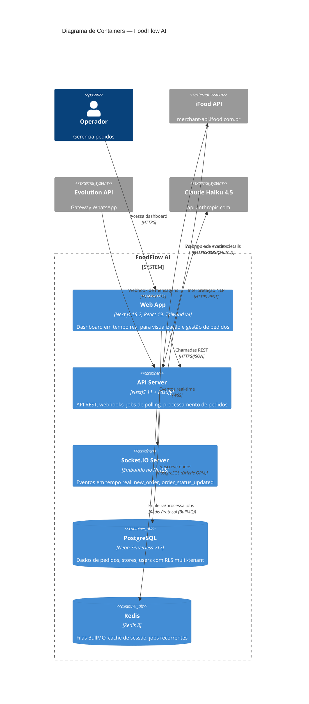

# C4 — Nível 2: Diagrama de Containers

## Escopo

Containers (aplicações e data stores) que compõem o FoodFlow AI.

## Diagrama

## Aplicações

| Container | Tecnologia | Responsabilidade | Hospedagem |
|-----------|-----------|-----------------|------------|
| Web App | Next.js 16.2, React 19, Tailwind CSS v4, shadcn/ui | Dashboard do operador com lista de pedidos em tempo real, login, gestão de status | Vercel (Edge) |
| API Server | NestJS 11, Fastify adapter | API REST, recepção de webhooks (iFood/WhatsApp), jobs BullMQ, processamento de pedidos | Render (Web Service) |
| Socket.IO Server | Socket.IO (embutido no NestJS) | Gateway WebSocket com rooms por store_id, emissão de eventos `new_order` e `order_status_updated` | Render (mesmo processo da API) |

## Data Stores

| Container | Tecnologia | Responsabilidade | Hospedagem | Backup |
|-----------|-----------|-----------------|------------|--------|
| PostgreSQL | Neon Serverless v17 | Dados persistentes: stores, users, orders, order_items, order_status_history, conversations, ifood_events. RLS multi-tenant | Neon (São Paulo) | Point-in-time recovery automático |
| Redis | Redis 8 | Filas BullMQ (processamento de pedidos, polling iFood), cache de tokens OAuth2 | Upstash ou Redis Cloud | Sem backup (dados efêmeros) |

## Relacionamentos entre Containers

| De | Para | Descrição | Protocolo / Formato |
|----|------|-----------|---------------------|
| Web App | API Server | Listagem de pedidos, atualização de status, login | HTTPS REST (JSON) |
| Web App | Socket.IO | Receber novos pedidos e atualizações em tempo real | WSS (JSON) |
| API Server | PostgreSQL | CRUD de todas as entidades | PostgreSQL via Drizzle ORM (connection pooling) |
| API Server | Redis | Enfileirar jobs, polling jobs, cache de tokens | Redis Protocol via BullMQ/ioredis |
| iFood API | API Server | Eventos de pedido (webhook POST) | HTTPS POST (JSON) |
| API Server | iFood API | Polling de eventos, detalhes do pedido, acknowledgment | HTTPS GET/POST (JSON, OAuth2 Bearer) |
| Evolution API | API Server | Mensagens WhatsApp (webhook POST) | HTTPS POST (JSON, API Key) |
| API Server | Claude Haiku | Interpretar texto de pedido WhatsApp | HTTPS POST (JSON, API Key) |
