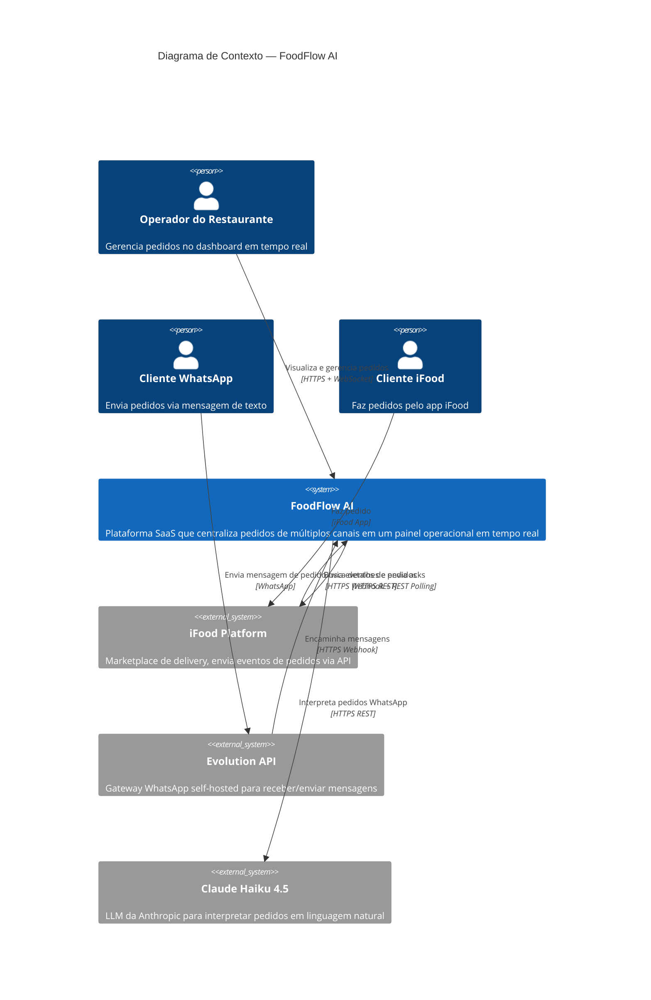

# C4 — Nível 1: Diagrama de Contexto

## Escopo

O FoodFlow AI no seu ambiente, mostrando usuários e sistemas externos com os quais interage.

## Diagrama

## Pessoas / Atores

| Ator | Descrição | Interação |
|------|-----------|-----------|
| Operador do Restaurante | Funcionário que gerencia pedidos recebidos | Acessa dashboard via browser (desktop/tablet) |
| Cliente WhatsApp | Consumidor que faz pedido por mensagem natural | Envia mensagem para número WhatsApp do restaurante |
| Cliente iFood | Consumidor que faz pedido pelo marketplace | Usa app/site iFood, não interage diretamente com FoodFlow |

## Sistemas Externos

| Sistema | Tipo | Descrição | Tecnologia |
|---------|------|-----------|------------|
| iFood Platform | Marketplace | Envia eventos de novos pedidos e atualizações | REST API (`merchant-api.ifood.com.br`) |
| Evolution API | Gateway | Recebe mensagens WhatsApp e encaminha via webhook | REST API self-hosted |
| Claude Haiku 4.5 | LLM | Interpreta mensagens em linguagem natural e extrai pedido estruturado | Anthropic API (`api.anthropic.com`) |

## Relacionamentos

| De | Para | Descrição | Protocolo |
|----|------|-----------|-----------|
| Operador | FoodFlow AI | Visualiza pedidos, atualiza status | HTTPS + WSS (Socket.IO) |
| iFood | FoodFlow AI | Envia eventos de pedido (webhook) | HTTPS POST (JSON) |
| FoodFlow AI | iFood | Polling de eventos (30s), busca detalhes, envia ack | HTTPS GET/POST (JSON, OAuth2) |
| Evolution API | FoodFlow AI | Encaminha mensagens WhatsApp | HTTPS POST (JSON, API Key) |
| FoodFlow AI | Claude Haiku | Envia mensagem para interpretação NLP | HTTPS POST (JSON, API Key) |
